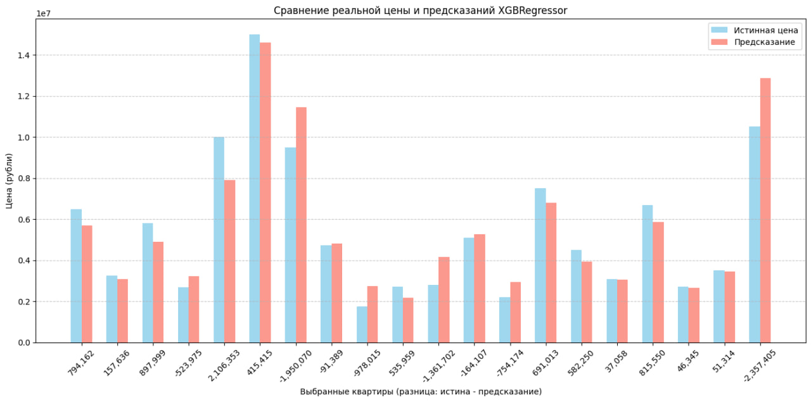

# Предсказание стоимости недвижимости

## Цель

Построить модель для предсказания стоимости объектов недвижимости на основе характеристик: площадь, количество комнат, этаж, регион, тип здания и т.д.

## Данные

* Источник: датасет ["Russian Real Estate 2021"](https://www.kaggle.com/datasets/mrdaniilak/russia-real-estate-2021)
* Объем: \~11 млн строк
* Основные признаки:

  * `area` - общая площадь
  * `rooms` - количество комнат
  * `kitchen_area` - площадь кухни
  * `levels` - количество этажей в доме
  * `level` - этаж квартиры
  * `id_region` - регион
  * категориальные признаки (`object_type`, `building_type`, `cluster`)

## Предобработка

* Заполнение пропусков (`unknown`)
* Кодирование категориальных признаков (`OneHotEncoder`, `LabelEncoder`)
* Масштабирование числовых признаков (`StandardScaler`)
* Логарифмирование целевой переменной (`price`) для стабилизации распределения

## Модели

Я протестировал несколько моделей:

1. **Baseline (LinearRegression)**
2. **Ridge Regression**
3. **RandomForestRegressor** (200k объектов)
4. **RandomForestRegressor (тюнинг + 500k объектов + RandomizedSearchCV)**
5. **CatBoostRegressor**
6. **CatBoostRegressor (тюнинг + 500k объектов, RandomizedSearchCV)**
7. **XGBoostRegressor**
8. **XGBoost (RandomizedSearchCV)**

## Метрика

Использовалась **RMSE (Root Mean Squared Error)**:

* в логарифмах (для стабильности)
* в рублях (обратное преобразование через `np.expm1`)

## Результаты

| Модель                       | RMSE (лог) | RMSE (руб) |
| -----------------------------| ---------- | ---------- |
| Linear Regression (baseline) | **0.510**  | **0.665**  |
| Ridge Regression             | **0.510**  | **0.665**  |
| RandomForest (200k)          | **0.319**  | **0.376**  |
| RandomForest (500k, tuned)   | **0.280**  | **0.323**  |
| CatBoost                     | **0.312**  | **0.367**  |
| СatBoost (500k, tuned)       | **0.311**  | **0.366**  |
| XGBoost                      | **0.305**  | **0.357**  |
| XGBoost (500k, tuned)        | **0.299**  | **0.348**  |

## Выводы

* Линейные модели (Linear, Ridge) показали слабый результат.
* Деревья (RandomForest, CatBoost, XGBoost) значительно улучшили точность.
* RandomForest (500k, tuned) показал хорошее качество (RMSE \~0.280 лог / \~0.323 руб), но был слишком медленным.
* Наилучшее сочетание точности и скорости дала модель **XGBoost (500k, tuned)** (RMSE \~0.323 руб).

## Визуализация точности предсказаний XGBoost(500k, tuned) 

## Дальнейшие шаги

* Добавить фичи (гео-признаки: метро, центр, инфраструктура).
* Добавить больше столбцов в датасет (кв.м. / кол-во комнат, категоризация студий и т.д.)
* Вынести процесс обучения модели в полноценный пайплайн для упрощения повторного обучения и оценки.